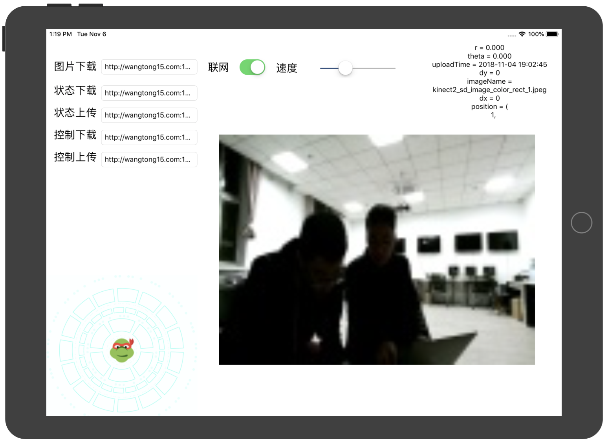

# TurtleBotTelecontroller 遥控App

## 手机端

### App代码

见TurtleBotTelecontroller

### App界面



- 左上角为服务器链接，暂时不需要更改
- 联网：从服务器上获取TurtleBot视角的图片
- 速度：调整TurtleBot移动速度
- 右上角文字：上传到服务器的控制指令和从服务器获取到的TurtleBot状态
- 左下角乌龟头：方向杆，可控制TurtleBot移动，不需要打开联网
- 图片：可放大缩小旋转

## TurtleBot端电脑

电脑上安装Ubuntu16.04系统和ROS kinetic

### ROS&TurtleBot安装指南

https://blog.csdn.net/xiaocainiaodeboke/article/details/51476557

### ROS代码

见turtle_tele_control

### Linux指令

电脑连上TurtleBot和Kinect，打开五个终端，每个终端依次输入其中一条指令，电脑要保持联网状态

```shell
roscore
roslaunch turtlebot_bringup minimal.launch
rosrun turtle_tele_control tele_control.py
rosrun kinect2_bridge kinect2_bridge _reg_method:=cpu
rosrun turtle_tele_control turtle_tele_broadcast.py
```

